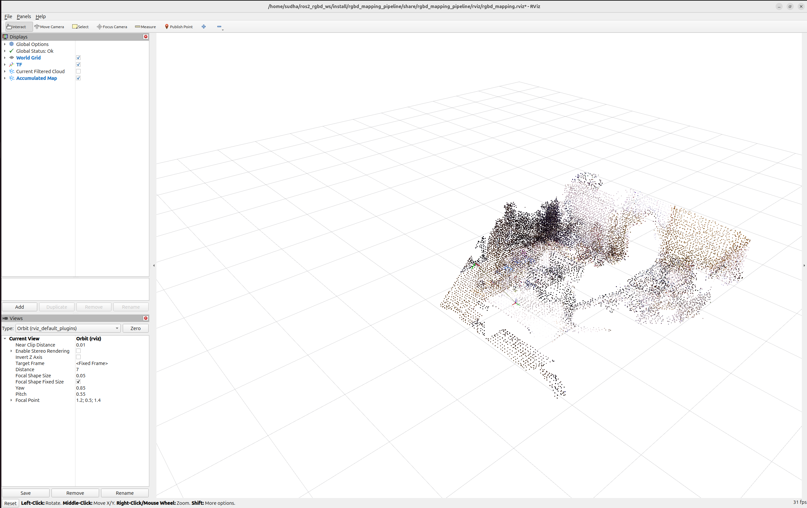

# ROS 2 RGB-D Mapping Pipeline

[](https://github.com/Sid-Dhar4/ros2-rgbd-mapping-pipeline/actions/workflows/ros2_jazzy_ci.yml)

A ROS 2 Jazzy RGB-D mapping project that replays public TUM RGB-D sequences, publishes RGB/depth/camera-info topics, converts depth images into colored PointCloud2 clouds, filters/downsamples the clouds, transforms them into a world frame using TUM ground-truth poses, accumulates a global map in a C++/PCL node, visualizes the result in RViz, and exports the final reconstruction as PCD/PLY.

This project is focused on reproducible RGB-D geometry, point-cloud processing, TF, C++ map accumulation, and measurable runtime behavior.

## Demo and results at a glance



Version 1 result on `rgbd_dataset_freiburg1_xyz`:

| Output | Result |
|---|---:|
| RGB-D replay | ~10 Hz |
| Raw and filtered cloud streams | ~10 Hz |
| Map publishing | ~1.66 Hz |
| Raw points per frame | ~14k to 15.5k |
| Filtered points per frame | ~1.5k to 6k |
| Typical point reduction | ~60 to 90 percent |
| Final accumulated map | ~17.8k points |
| Exported sample maps | PCD and PLY |

The accumulated map is published on `/map/cloud` in the `world` frame. The map is generated by a C++/PCL accumulator from filtered RGB-D point clouds and TUM ground-truth TF poses.


## What works

- RGB-D dataset replay from TUM RGB-D
- RGB/depth timestamp association
- RGB-D plus ground-truth pose association
- ROS 2 image and camera calibration publishing
- Depth image to colored PointCloud2 projection
- Voxel/range filtering of point clouds
- TF publishing from world to camera_color_optical_frame
- C++/PCL world-frame map accumulation
- /map/cloud publishing
- PCD/PLY map export
- RViz visualization
- Basic runtime and point-count metrics

## Quick start

Source ROS and the workspace:

```bash
source /opt/ros/jazzy/setup.bash
source ~/ros2_rgbd_ws/install/setup.bash
```

Run the full mapping pipeline:

```bash
ros2 launch rgbd_mapping_pipeline mapping_pipeline.launch.py
```

Run the full mapping pipeline with RViz:

```bash
ros2 launch rgbd_mapping_pipeline rviz_mapping.launch.py
```

## Dataset setup

The full TUM RGB-D sequence is not committed to this repository. Download and prepare it locally:

```bash
cd ~/ros2_rgbd_ws/src/ros2-rgbd-mapping-pipeline/data
wget https://cvg.cit.tum.de/rgbd/dataset/freiburg1/rgbd_dataset_freiburg1_xyz.tgz
tar -xzf rgbd_dataset_freiburg1_xyz.tgz
```

Create the RGB-depth and RGB-D-pose association files:

```bash
cd ~/ros2_rgbd_ws/src/ros2-rgbd-mapping-pipeline
python3 scripts/make_tum_associations.py --dataset-dir data/rgbd_dataset_freiburg1_xyz --max-time-diff 0.02
python3 scripts/make_tum_rgbd_pose_associations.py --dataset-dir data/rgbd_dataset_freiburg1_xyz --max-time-diff 0.05
```

The final map is saved on shutdown:

```text
outputs/maps/final_map_cpp.pcd
outputs/maps/final_map_cpp.ply
```

## Main ROS topics

| Topic | Purpose |
|---|---|
| /camera/color/image_raw | Replayed RGB images |
| /camera/depth/image_raw | Replayed depth images |
| /camera/color/camera_info | Camera intrinsics |
| /rgbd/cloud_raw | Colored cloud from RGB-D projection |
| /rgbd/cloud_filtered | Filtered/downsampled cloud |
| /tf | world to camera_color_optical_frame |
| /map/cloud | Accumulated world-frame map |

## How to read the results

- /rgbd/cloud_raw validates RGB-D projection using camera intrinsics.
- /rgbd/cloud_filtered validates point-count reduction before mapping.
- /map/cloud is the accumulated world-frame point-cloud map.
- final_map_cpp.pcd and final_map_cpp.ply are exported sample reconstructions.

This project uses TUM ground-truth poses for map accumulation. It is a mapping and reconstruction pipeline, not a full SLAM system.

## Verification commands

Check topics:

```bash
ros2 topic list | grep -E "camera/color|camera/depth|rgbd/cloud|map/cloud|/tf"
```

Check map cloud rate:

```bash
ros2 topic hz /map/cloud
```

Inspect TF:

```bash
ros2 run tf2_ros tf2_echo world camera_color_optical_frame
```

Inspect exported maps:

```bash
ls -lh outputs/maps
file outputs/maps/final_map_cpp.pcd
file outputs/maps/final_map_cpp.ply
```

## Tests

Run the functional Python tests:

```bash
cd ~/ros2_rgbd_ws
source /opt/ros/jazzy/setup.bash
source install/setup.bash
colcon test --packages-select rgbd_mapping_pipeline
colcon test-result --verbose
```

The current tests cover camera projection and voxel filtering.

## Limitations

- Uses TUM ground-truth camera poses for map accumulation; this is not a full SLAM system.
- Designed for reproducible offline evaluation, not live robot deployment yet.
- Dynamic objects and invalid depth pixels are not explicitly removed.
- Map quality depends on depth validity, camera intrinsics, pose alignment, and voxel resolution.
- The output is a colored point-cloud map, not a dense mesh.

## Future work

- Add automated metrics logging across multiple sequences.
- Add C++ gtests for point-cloud utility functions.
- Add CI for build and tests.
- Add Docker or devcontainer setup.
- Compare pose sources: ground truth vs visual odometry or SLAM.
- Add optional RealSense live-camera mode.

## How to verify in 60 seconds

1. Run the RViz demo:

```bash
ros2 launch rgbd_mapping_pipeline rviz_mapping.launch.py
```

2. Confirm these topics exist:

```bash
ros2 topic list | grep -E "rgbd/cloud|map/cloud|/tf"
```

3. Confirm the map is publishing:

```bash
ros2 topic hz /map/cloud
```

4. Stop the launch with Ctrl+C and confirm that PCD/PLY files are saved in `outputs/maps/`.

## Design choices

- Python is used for fast dataset replay, image loading, RGB-D projection, and early-stage pipeline iteration.
- C++/PCL is used for the map accumulator because world-frame point-cloud accumulation and voxel downsampling are performance-sensitive.
- TUM ground-truth poses are used intentionally so Version 1 can focus on reproducible RGB-D geometry, TF, point-cloud filtering, and mapping before adding visual odometry or SLAM.
- The repo does not commit the full TUM dataset; scripts and documentation describe how the data is prepared locally.
